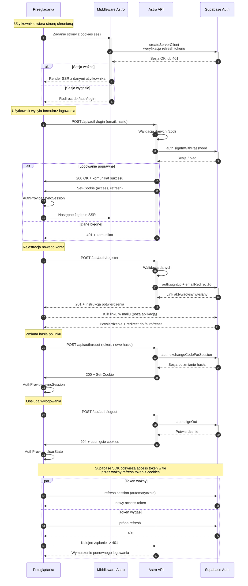

<authentication_analysis>
1. Przepływy autentykacji: logowanie istniejącego użytkownika (formularz → Astro API → Supabase → ustanowienie sesji), rejestracja (formularz → API → Supabase → mail potwierdzający → autologowanie), reset hasła (żądanie linku → mail → ustawienie nowego hasła), ponowna weryfikacja sesji przy SSR (middleware `createServerClient`), odświeżanie tokenu przez Supabase cookies, wylogowanie (API → Supabase → usunięcie cookies).
2. Aktorzy: Przeglądarka (formulare React + stan AuthProvider), Middleware Astro (ustawia `Astro.locals.supabase` przez cookies), Astro API (`/api/auth/*`, `/api/favorites`), Supabase Auth (usługa zewnętrzna zarządzająca użytkownikami, sesją, mailami).
3. Weryfikacja i odświeżanie tokenów: Middleware odczytuje cookies i tworzy klienta; Supabase SDK automatycznie odnawia access token przy ważnym refresh tokenie; w razie błędu API reaguje 401 i wymusza redirect. Supabase wysyła maile weryfikacyjne i link resetu; potwierdzenie ustawia aktywną sesję. Wylogowanie usuwa refresh i access tokeny (cookies).
4. Kroki autentykacji: (a) użytkownik przesyła formularz; (b) API waliduje dane (`zod`), inicjuje żądanie do Supabase; (c) Supabase zwraca sukces/błąd oraz ustawia/weryfikuje sesję; (d) API przekazuje wynik do przeglądarki i ustawia cookies; (e) po sukcesie AuthProvider synchronizuje stan i przekierowuje użytkownika; (f) przy kolejnych SSR middleware weryfikuje cookies i udostępnia aktualną sesję; (g) przy wygaśnięciu tokenu Supabase próbuje odświeżyć, w razie niepowodzenia API zwraca 401 i frontend prosi o ponowne logowanie.
</authentication_analysis>

<mermaid_diagram>

</mermaid_diagram>
