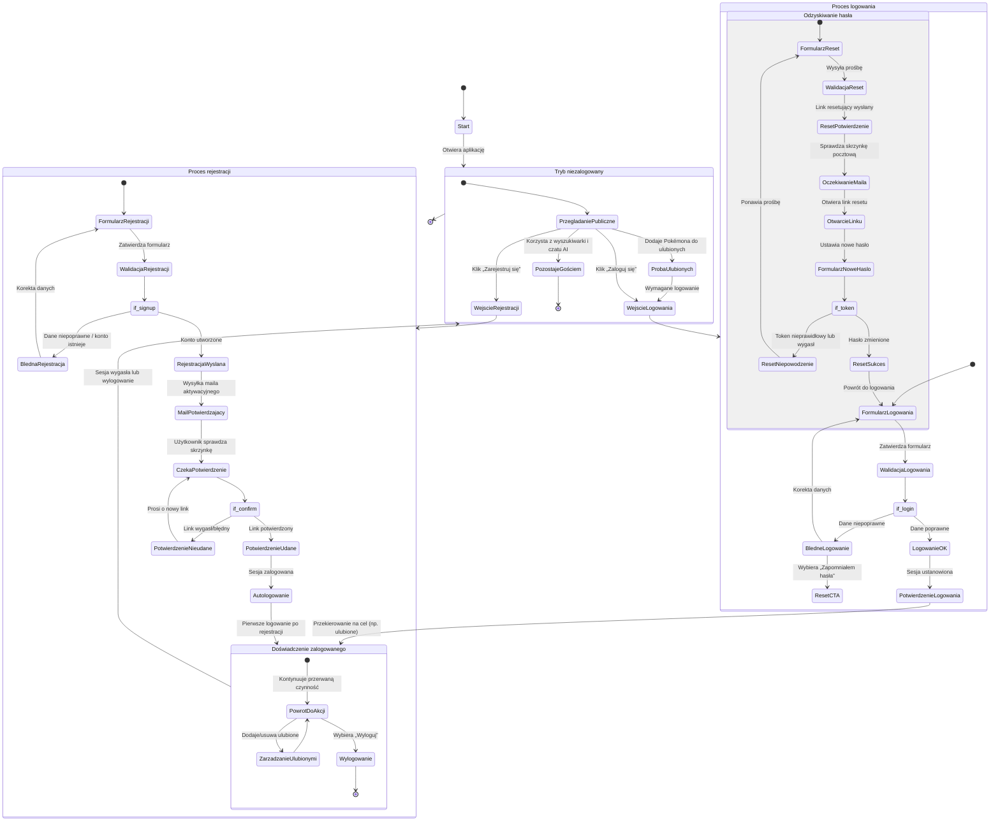

<user_journey_analysis>

1. Ścieżki użytkownika: eksploracja jako gość (wyszukiwarka, czat AI), próba dodania do ulubionych, przejście do logowania, rejestracja nowego konta z potwierdzeniem e-mail, logowanie istniejącego konta, odzyskiwanie hasła poprzez link resetujący, powrót do pierwotnej aktywności po zalogowaniu.
2. Główne podróże i stany: tryb niezalogowany (przeglądanie publiczne vs. akcje wymagające auth), proces logowania (formularz, walidacja, sukces/błąd), proces rejestracji (formularz, walidacja, wysyłka maila, weryfikacja), proces resetu hasła (żądanie maila, ustawienie nowego hasła), stan zalogowany (powrót do docelowej strony, zarządzanie ulubionymi, wylogowanie).
3. Punkty decyzyjne: poprawność danych logowania, wybór resetu hasła po błędzie, poprawność danych rejestracyjnych, ważność linku weryfikacyjnego w mailu, powodzenie resetu hasła (token), decyzja o wylogowaniu.
4. Cel stanów: tryb niezalogowany umożliwia dostęp do funkcji publicznych; formularze logowania/rejestracji zbierają dane i raportują błędy; stany walidacji determinują przebieg; stany wysyłki maila informują o konieczności akcji poza aplikacją; stan zalogowany przywraca użytkownika do wcześniej wybranej funkcji (np. ulubione) i umożliwia obsługę konta; wylogowanie kończy sesję i wraca do trybu gościa.
   </user_journey_analysis>

<mermaid_diagram>

</mermaid_diagram>
