<architecture_analysis>
1. **Komponenty**: Layout.astro (bazowy), MainLayout.astro, AuthLayout.astro, AppTopBar.astro, strony Astro (`login.astro`, `register.astro`, `forgot.astro`, `reset.astro`, `favorites.astro`, `settings.astro`, `ai.astro`), React (`AuthProvider.tsx`, `AuthSessionHydrator.tsx`, `LoginForm.tsx`, `RegisterForm.tsx`, `ForgotPasswordForm.tsx`, `ResetPasswordForm.tsx`, `UserMenu.tsx`, `AuthToaster.tsx`, `FavoritesList.tsx`, `AIChatPanel.tsx`, `RateLimitAlert.tsx`), moduły (`useAuthStore.ts`, `supabase.client.ts`, endpointy `/api/auth/*`, `/api/favorites`).
2. **Strony i komponenty**: Strony logowania/rejestracji/resetu korzystają z AuthLayout + odpowiednich formularzy React oraz AuthToaster; `favorites.astro` i `settings.astro` używają MainLayout z AppTopBar i komponentami klienckimi (`FavoritesList`, w przyszłości sekcje ustawień); `ai.astro` utrzymuje integrację z `AIChatPanel`, który po zmianach korzysta z `AuthProvider`.
3. **Przepływ danych**: Middleware (`createServerClient`) udostępnia `Astro.locals.supabase` stronom SSR; strony przekazują dane sesji do `AuthSessionHydrator` i `AuthProvider`; formularze React walidują wejście (`zod`) i wywołują `/api/auth/*`, które aktualizują cookies Supabase; `AuthProvider` synchronizuje wynik z `useAuthStore`, a stan trafia do `AppTopBar`, `FavoritesList`, `AIChatPanel`; `FavoritesList` oraz `AIChatPanel` korzystają z `/api/favorites` do spójnej listy ulubionych.
4. **Opis komponentów**: MainLayout rozszerzony o AppTopBar i nawigację; AuthLayout zapewnia spójny kontener i slot na powiadomienia; AppTopBar renderuje globalne CTA i menu użytkownika; formularze React obsługują walidację i wywołania API; AuthProvider + useAuthStore zarządzają stanem sesji; AuthToaster dostarcza komunikaty; FavoritesList renderuje ulubione z obsługą akcji; AIChatPanel wykorzystuje stan auth do zarządzania ulubionymi; endpointy `/api/auth/*` oraz `/api/favorites` mostkują UI z Supabase.

```mermaid
flowchart TD
  classDef updated fill:#ffeccf,stroke:#d97706,stroke-width:2px;
  classDef service fill:#e0f2fe,stroke:#0369a1,stroke-width:1.5px;
  classDef state fill:#dcfce7,stroke:#15803d,stroke-width:1.5px;

  subgraph SSR["Warstwa SSR Astro"]
    Middleware["middleware/index.ts\n(createServerClient)"]:::updated
    MainLayout["MainLayout.astro\nlayout z AppTopBar"]:::updated
    AuthLayout["AuthLayout.astro\nkontener formularzy"]:::updated
    AppTopBar["AppTopBar.astro\nslot akcji użytkownika"]:::updated
    LoginPage["login.astro\nSSR formularza logowania"]:::updated
    RegisterPage["register.astro\nSSR formularza rejestracji"]:::updated
    ForgotPage["forgot.astro\nSSR resetu linku"]:::updated
    ResetPage["reset.astro\nSSR zmiany hasła"]:::updated
    FavoritesPage["favorites.astro\nSSR listy ulubionych"]:::updated
    SettingsPage["settings.astro\nplaceholder ustawień"]:::updated
    AiPage["ai.astro\nSSR czatu AI"]
  end

  subgraph React["Komponenty React (client)"]
    AuthProvider["AuthProvider.tsx\nkontekst Supabase"]:::updated
    AuthSessionHydrator["AuthSessionHydrator.tsx\nhydracja sesji"]:::updated
    LoginForm["LoginForm.tsx\nwalidacja & submit"]:::updated
    RegisterForm["RegisterForm.tsx"]:::updated
    ForgotForm["ForgotPasswordForm.tsx"]:::updated
    ResetForm["ResetPasswordForm.tsx"]:::updated
    UserMenu["UserMenu.tsx\nmenu użytkownika"]:::updated
    AuthToaster["AuthToaster.tsx\npowiadomienia"]:::updated
    FavoritesList["FavoritesList.tsx\nkarty ulubionych"]:::updated
    AIChatPanel["AIChatPanel.tsx\npanel czatu"]:::updated
    RateLimitAlert["RateLimitAlert.tsx\nobsługa limitów"]
  end

  subgraph State["Stan i integracje"]
    UseAuthStore["useAuthStore.ts\n(Zustand)"]:::updated
    SupabaseClient["supabase.client.ts\nclient przeglądarkowy"]
    AuthApi["Astro /api/auth/*"]:::updated
    FavoritesApi["Astro /api/favorites"]:::updated
  end

  Middleware --"Astro.locals.supabase"--> LoginPage
  Middleware --"Astro.locals.supabase"--> RegisterPage
  Middleware --"Astro.locals.supabase"--> ForgotPage
  Middleware --"Astro.locals.supabase"--> ResetPage
  Middleware --"Astro.locals.supabase"--> FavoritesPage
  Middleware --"Astro.locals.supabase"--> AiPage

  LoginPage --> AuthLayout
  RegisterPage --> AuthLayout
  ForgotPage --> AuthLayout
  ResetPage --> AuthLayout
  FavoritesPage --> MainLayout
  SettingsPage --> MainLayout
  AiPage --> MainLayout
  MainLayout --> AppTopBar

  AuthLayout --> LoginForm
  AuthLayout --> RegisterForm
  AuthLayout --> ForgotForm
  AuthLayout --> ResetForm
  AuthLayout --> AuthToaster
  AppTopBar --> UserMenu
  FavoritesPage --> FavoritesList
  AiPage --> AIChatPanel

  LoginForm --"POST /api/auth/login"--> AuthApi
  RegisterForm --"POST /api/auth/register"--> AuthApi
  ForgotForm --"POST /api/auth/forgot"--> AuthApi
  ResetForm --"POST /api/auth/reset"--> AuthApi
  UserMenu --"POST /api/auth/logout"--> AuthApi

  AuthApi --"sesja & cookies"--> AuthProvider
  AuthSessionHydrator --> AuthProvider
  AuthProvider --"synchronizacja"--> UseAuthStore
  UseAuthStore --"stan użytkownika"--> UserMenu
  UseAuthStore --"stan użytkownika"--> FavoritesList
  UseAuthStore --"stan użytkownika"--> AIChatPanel
  FavoritesList --"GET /api/favorites"--> FavoritesApi
  AIChatPanel --"toggle ulubionych"--> FavoritesApi

  AuthApi --"Supabase SDK"--> SupabaseClient
  FavoritesApi --"Supabase RLS"--> SupabaseClient
  SupabaseClient -.-> AuthProvider

  AIChatPanel --> RateLimitAlert

  class Middleware,MainLayout,AuthLayout,AppTopBar,LoginPage,RegisterPage,ForgotPage,ResetPage,FavoritesPage,SettingsPage,AuthProvider,AuthSessionHydrator,LoginForm,RegisterForm,ForgotForm,ResetForm,UserMenu,AuthToaster,FavoritesList,AIChatPanel,UseAuthStore,AuthApi,FavoritesApi updated;
  class AuthApi,FavoritesApi service;
  class UseAuthStore state;
```

</architecture_analysis>

<mermaid_diagram>

</mermaid_diagram>
