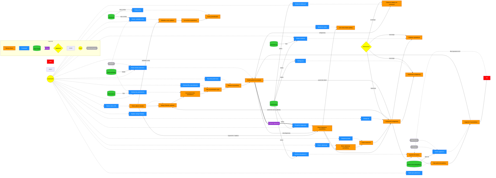

```mermaid
flowchart LR
subgraph Legenda
  DE0[Domain Event]
  CMD0[Command]
  RM0[(Read Model)]
  POL0>Policy]
  AGG0{Aggregate}
  HS0/!/
  ACT0((Actor))
  EX0{{External System}}

  style DE0 fill:#FF9900,color:black
  style CMD0 fill:#1E90FF,color:white
  style RM0 fill:#32CD32,color:black
  style POL0 fill:#9932CC,color:white
  style AGG0 fill:#FFFF00,color:black
  style HS0 fill:#FF0000,color:white
  style ACT0 fill:#FFFF00,color:black
  style EX0 fill:#A9A9A9,color:white
end

DE1[Strona główna otwarta]
style DE1 fill:#FF9900,color:black

DE2[Sekcja Pokedex wybrana]
style DE2 fill:#FF9900,color:black

DE3[Lista pokemonów wyświetlona]
style DE3 fill:#FF9900,color:black

DE4[Filtry wyszukiwarki użyte]
style DE4 fill:#FF9900,color:black

DE5[Pokemon wyszukany]
style DE5 fill:#FF9900,color:black

DE6[Detale pokemona otwarte]
style DE6 fill:#FF9900,color:black

DE7[Pokemon dodany do ulubionych]
style DE7 fill:#FF9900,color:black

DE1 --> DE2 --> DE3 --> DE4 --> DE5 --> DE6

DE8[Ekran logowania wyświetlony]
style DE8 fill:#FF9900,color:black

DE9[Użytkownik zalogowany]
style DE9 fill:#FF9900,color:black

DE10[Ekran rejestracji wyświetlony]
style DE10 fill:#FF9900,color:black

DE11[Link resetu hasła wysłany]
style DE11 fill:#FF9900,color:black

DE12[Konto utworzone]
style DE12 fill:#FF9900,color:black

DE13[Ulubione wyświetlone]
style DE13 fill:#FF9900,color:black

DE14[Asystent AI otwarty]
style DE14 fill:#FF9900,color:black

DE15[Opis pokemona podany]
style DE15 fill:#FF9900,color:black

DE16[Sugestie AI wyświetlone]
style DE16 fill:#FF9900,color:black

DE17[Użytkownik wylogowany]
style DE17 fill:#FF9900,color:black

DE18[Zakładka ruchy wybrana]
style DE18 fill:#FF9900,color:black

DE19[List ruchów wyświetlona]
style DE19 fill:#FF9900,color:black

DE20[Ruchy posortowane]
style DE20 fill:#FF9900,color:black

DE1 -->|logowanie z topbara| DE8
DE6 -->|niezalogowany| DE8
DE6 -->|zalogowany| DE7
DE8 --> DE9
DE8 --> DE10
DE8 --> DE11
DE10 --> DE12
DE12 --> DE9
DE9 -->|powrót do strony głównej| DE2
DE9 -->|powrót do detali| DE6
DE9 --> DE13
DE9 --> DE14
DE14 --> DE15 --> DE16
DE16 --> DE6
DE9 --> DE17
HS1/!/
style HS1 fill:#FF0000,color:white

DE16 --- HS1
HS1 -.->|"Brak powrotu do AI"| DE14
DE1 -->|zakładka ruchy| DE18
DE18 --> DE19 --> DE20

ACT1((Użytkownik))
style ACT1 fill:#FFFF00,color:black

CMD1[Otwórz adres URL]
style CMD1 fill:#1E90FF,color:white

ACT1 -.-> CMD1
CMD1 -.-> DE1

CMD2[Wybierz sekcję Pokedex]
style CMD2 fill:#1E90FF,color:white

ACT1 -.-> CMD2
CMD2 -.-> DE2

CMD3[Załaduj listę pokemonów]
style CMD3 fill:#1E90FF,color:white

ACT1 -.-> CMD3
CMD3 -.-> DE3

RM1[(PokemonList)]
style RM1 fill:#32CD32,color:black

RM1 -->|lista| CMD3

CMD4[Zastosuj filtry wyszukiwania]
style CMD4 fill:#1E90FF,color:white

ACT1 -.-> CMD4
CMD4 -.-> DE4

CMD5[Wyszukaj pokemona]
style CMD5 fill:#1E90FF,color:white

ACT1 -.-> CMD5
CMD5 -.-> DE5

CMD6[Otwórz detale pokemona]
style CMD6 fill:#1E90FF,color:white

ACT1 -.-> CMD6
CMD6 -.-> DE6

RM2[(PokemonDetails)]
style RM2 fill:#32CD32,color:black

RM2 -->|detale| CMD6

CMD7[Dodaj do ulubionych]
style CMD7 fill:#1E90FF,color:white

ACT1 -.-> CMD7
CMD7 -.-> DE7

RM3[(UserSession)]
style RM3 fill:#32CD32,color:black

RM4[(FavoritesList)]
style RM4 fill:#32CD32,color:black

RM3 -->|status| CMD7
RM3 -->|status| CMD8
RM3 -->|status| CMD13
RM3 -->|status| CMD14
RM3 -->|status| CMD17
RM4 -->|lista| CMD13

RM5[(PokemonKnowledgeBase)]
style RM5 fill:#32CD32,color:black

RM5 -->|dane AI| CMD16

CMD8[Przejdź do logowania]
style CMD8 fill:#1E90FF,color:white

ACT1 -.-> CMD8
CMD8 -.-> DE8

CMD9[Zaloguj się]
style CMD9 fill:#1E90FF,color:white

CMD10[Otwórz rejestrację]
style CMD10 fill:#1E90FF,color:white

CMD11[Wyślij link resetu]
style CMD11 fill:#1E90FF,color:white

CMD12[Zarejestruj konto]
style CMD12 fill:#1E90FF,color:white

ACT1 -.-> CMD9
CMD9 -.-> DE9
ACT1 -.-> CMD10
CMD10 -.-> DE10
ACT1 -.-> CMD11
CMD11 -.-> DE11
ACT1 -.-> CMD12
CMD12 -.-> DE12

CMD13[Otwórz ulubione]
style CMD13 fill:#1E90FF,color:white

CMD14[Uruchom Asystenta AI]
style CMD14 fill:#1E90FF,color:white

CMD15[Wyślij opis pokemona]
style CMD15 fill:#1E90FF,color:white

CMD16[Zwróć sugestie AI]
style CMD16 fill:#1E90FF,color:white

CMD17[Wyloguj się]
style CMD17 fill:#1E90FF,color:white

ACT1 -.-> CMD13
CMD13 -.-> DE13
ACT1 -.-> CMD14
CMD14 -.-> DE14
ACT1 -.-> CMD15
CMD15 -.-> DE15
ACT1 -.-> CMD17
CMD17 -.-> DE17

EX1{{AI Engine}}
style EX1 fill:#A9A9A9,color:white

EX1 -.-> CMD16
CMD16 -.-> DE16

EX2{{PokeAPI}}
style EX2 fill:#A9A9A9,color:white

EX3{{OpenRouter}}
style EX3 fill:#A9A9A9,color:white

EX2 -.-> CMD3
EX2 -.-> CMD6
EX2 -.-> CMD18
EX3 -.-> CMD16

CMD18[Otwórz zakładkę ruchy]
style CMD18 fill:#1E90FF,color:white

CMD19[Sortuj ruchy]
style CMD19 fill:#1E90FF,color:white

ACT1 -.-> CMD18
CMD18 -.-> DE18
ACT1 -.-> CMD19
CMD19 -.-> DE20

RM6[(MovesList)]
style RM6 fill:#32CD32,color:black

RM6 -->|lista ruchów| CMD18
RM6 -->|lista ruchów| CMD19

AGG1{UserAccount}
style AGG1 fill:#FFFF00,color:black

AGG1 -->|kontroluje| DE7
AGG1 -->|kontroluje| DE9
AGG1 -->|kontroluje| DE13
AGG1 -->|kontroluje| DE17

POL1>Wymuś logowanie]
style POL1 fill:#9932CC,color:white

DE6 ==> POL1
POL1 ==> CMD8
```
