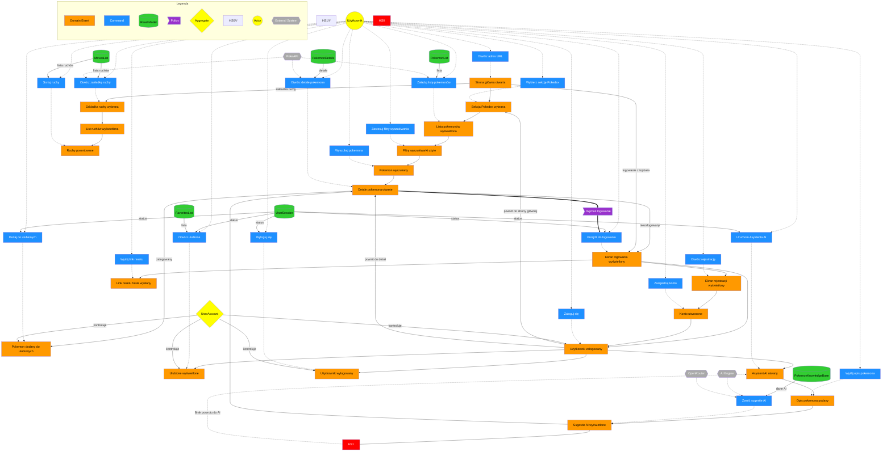

```mermaid
flowchart TB

%% Domain Events
DE1[Strona główna otwarta]
DE2[Sekcja Pokedex wybrana]
DE3[Lista pokemonów wyświetlona]
DE4[Filtry wyszukiwarki użyte]
DE5[Pokemon wyszukany]
DE6[Detale pokemona otwarte]
DE7[Pokemon dodany do ulubionych]
DE8[Ekran logowania wyświetlony]
DE9[Użytkownik zalogowany]
DE10[Ekran rejestracji wyświetlony]
DE11[Link resetu hasła wysłany]
DE12[Konto utworzone]
DE13[Ulubione wyświetlone]
DE14[Asystent AI otwarty]
DE15[Opis pokemona podany]
DE16[Sugestie AI wyświetlone]
DE17[Użytkownik wylogowany]
DE18[Zakładka ruchy wybrana]
DE19[List ruchów wyświetlona]
DE20[Ruchy posortowane]

style DE1 fill:#FF9900,color:black
style DE2 fill:#FF9900,color:black
style DE3 fill:#FF9900,color:black
style DE4 fill:#FF9900,color:black
style DE5 fill:#FF9900,color:black
style DE6 fill:#FF9900,color:black
style DE7 fill:#FF9900,color:black
style DE8 fill:#FF9900,color:black
style DE9 fill:#FF9900,color:black
style DE10 fill:#FF9900,color:black
style DE11 fill:#FF9900,color:black
style DE12 fill:#FF9900,color:black
style DE13 fill:#FF9900,color:black
style DE14 fill:#FF9900,color:black
style DE15 fill:#FF9900,color:black
style DE16 fill:#FF9900,color:black
style DE17 fill:#FF9900,color:black
style DE18 fill:#FF9900,color:black
style DE19 fill:#FF9900,color:black
style DE20 fill:#FF9900,color:black

DE1 --> DE2 --> DE3 --> DE4 --> DE5 --> DE6
DE6 -->|zalogowany| DE7
DE6 -->|niezalogowany| DE8
DE8 --> DE9
DE8 --> DE10
DE8 --> DE11
DE10 --> DE12 --> DE9
DE9 -->|powrót do strony głównej| DE2
DE9 -->|powrót do detali| DE6
DE9 --> DE13
DE9 --> DE14
DE14 --> DE15 --> DE16
DE16 --> DE6
DE9 --> DE17
DE1 -->|logowanie z topbara| DE8
DE1 -->|zakładka ruchy| DE18 --> DE19 --> DE20

HS1/!/
style HS1 fill:#FF0000,color:white
DE16 --- HS1
HS1 -.->|"Brak powrotu do AI"| DE14

%% Commands & Actor
ACT1((Użytkownik))

CMD1[Otwórz adres URL]
CMD2[Wybierz sekcję Pokedex]
CMD3[Załaduj listę pokemonów]
CMD4[Zastosuj filtry wyszukiwania]
CMD5[Wyszukaj pokemona]
CMD6[Otwórz detale pokemona]
CMD7[Dodaj do ulubionych]
CMD8[Przejdź do logowania]
CMD9[Zaloguj się]
CMD10[Otwórz rejestrację]
CMD11[Wyślij link resetu]
CMD12[Zarejestruj konto]
CMD13[Otwórz ulubione]
CMD14[Uruchom Asystenta AI]
CMD15[Wyślij opis pokemona]
CMD16[Zwróć sugestie AI]
CMD17[Wyloguj się]
CMD18[Otwórz zakładkę ruchy]
CMD19[Sortuj ruchy]

style ACT1 fill:#FFFF00,color:black
style CMD1 fill:#1E90FF,color:white
style CMD2 fill:#1E90FF,color:white
style CMD3 fill:#1E90FF,color:white
style CMD4 fill:#1E90FF,color:white
style CMD5 fill:#1E90FF,color:white
style CMD6 fill:#1E90FF,color:white
style CMD7 fill:#1E90FF,color:white
style CMD8 fill:#1E90FF,color:white
style CMD9 fill:#1E90FF,color:white
style CMD10 fill:#1E90FF,color:white
style CMD11 fill:#1E90FF,color:white
style CMD12 fill:#1E90FF,color:white
style CMD13 fill:#1E90FF,color:white
style CMD14 fill:#1E90FF,color:white
style CMD15 fill:#1E90FF,color:white
style CMD16 fill:#1E90FF,color:white
style CMD17 fill:#1E90FF,color:white
style CMD18 fill:#1E90FF,color:white
style CMD19 fill:#1E90FF,color:white

ACT1 -.-> CMD1
ACT1 -.-> CMD2
ACT1 -.-> CMD3
ACT1 -.-> CMD4
ACT1 -.-> CMD5
ACT1 -.-> CMD6
ACT1 -.-> CMD7
ACT1 -.-> CMD8
ACT1 -.-> CMD9
ACT1 -.-> CMD10
ACT1 -.-> CMD11
ACT1 -.-> CMD12
ACT1 -.-> CMD13
ACT1 -.-> CMD14
ACT1 -.-> CMD15
ACT1 -.-> CMD17
ACT1 -.-> CMD18
ACT1 -.-> CMD19

CMD1 -.-> DE1
CMD2 -.-> DE2
CMD3 -.-> DE3
CMD4 -.-> DE4
CMD5 -.-> DE5
CMD6 -.-> DE6
CMD7 -.-> DE7
CMD8 -.-> DE8
CMD9 -.-> DE9
CMD10 -.-> DE10
CMD11 -.-> DE11
CMD12 -.-> DE12
CMD13 -.-> DE13
CMD14 -.-> DE14
CMD15 -.-> DE15
CMD16 -.-> DE16
CMD17 -.-> DE17
CMD18 -.-> DE18
CMD19 -.-> DE20

%% Read Models
RM1[(PokemonList)]
RM2[(PokemonDetails)]
RM3[(UserSession)]
RM4[(FavoritesList)]
RM5[(PokemonKnowledgeBase)]
RM6[(MovesList)]

style RM1 fill:#32CD32,color:black
style RM2 fill:#32CD32,color:black
style RM3 fill:#32CD32,color:black
style RM4 fill:#32CD32,color:black
style RM5 fill:#32CD32,color:black
style RM6 fill:#32CD32,color:black

RM1 -->|lista| CMD3
RM2 -->|detale| CMD6
RM3 -->|status| CMD7
RM3 -->|status| CMD8
RM3 -->|status| CMD13
RM3 -->|status| CMD14
RM3 -->|status| CMD17
RM4 -->|lista| CMD13
RM5 -->|dane AI| CMD16
RM6 -->|lista ruchów| CMD18
RM6 -->|lista ruchów| CMD19

%% Aggregate
AGG1{UserAccount}
style AGG1 fill:#FFFF00,color:black

AGG1 -->|kontroluje| DE7
AGG1 -->|kontroluje| DE9
AGG1 -->|kontroluje| DE13
AGG1 -->|kontroluje| DE17

%% Policy
POL1>Wymuś logowanie]
style POL1 fill:#9932CC,color:white
DE6 ==> POL1
POL1 ==> CMD8

%% External Systems
EX1{{AI Engine}}
EX2{{PokeAPI}}
EX3{{OpenRouter}}

style EX1 fill:#A9A9A9,color:white
style EX2 fill:#A9A9A9,color:white
style EX3 fill:#A9A9A9,color:white

EX1 -.-> CMD16
EX3 -.-> CMD16
EX2 -.-> CMD3
EX2 -.-> CMD6
EX2 -.-> CMD18

%% Legend
subgraph Legenda
  direction TB
  DE0[Domain Event]
  CMD0[Command]
  RM0[(Read Model)]
  POL0>Policy]
  AGG0{Aggregate}
  HS0/!/
  ACT0((Actor))
  EX0{{External System}}

  style DE0 fill:#FF9900,color:black
  style CMD0 fill:#1E90FF,color:white
  style RM0 fill:#32CD32,color:black
  style POL0 fill:#9932CC,color:white
  style AGG0 fill:#FFFF00,color:black
  style HS0 fill:#FF0000,color:white
  style ACT0 fill:#FFFF00,color:black
  style EX0 fill:#A9A9A9,color:white
end
```
